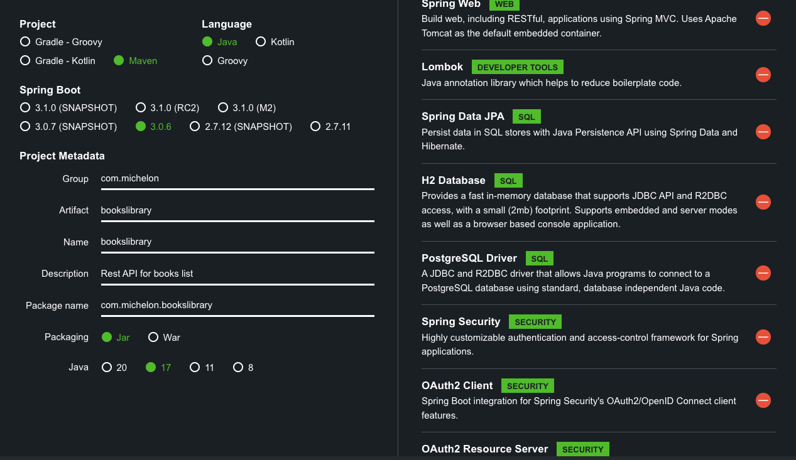

<h1 align="center"> Book Library REST API </h1>

API for books list  

  <a href="#-setup">Setup</a>&nbsp;&nbsp;&nbsp;|&nbsp;&nbsp;&nbsp;
  <a href="#-technologies">Technologies</a>&nbsp;&nbsp;&nbsp;|&nbsp;&nbsp;&nbsp;
  <a href="#-project">Project</a>&nbsp;&nbsp;&nbsp;|&nbsp;&nbsp;&nbsp;
  <a href="#-acknowledgment">Acknowledgment</a>&nbsp;&nbsp;&nbsp;|&nbsp;&nbsp;&nbsp;
  <a href="#memo-licença">License</a>

  

 

> Note! This project is a working in progress

 

## 🚧 Setup

### To have this project running locally:

1 - Clone the project using `git clone`

2 - Create an account on the OpenAi platform

3 - Copy the OpenAi API key to the `application.properties` file

4 - On the Controller, check the Client URL on the @CrossOrigin annotation

5 - Run the application

6 - Test the application via curl (or an HTTP client of your choice) 

## 🚀 Technologies

- Java 17
- Maven
- Spring Boot
- Spring Data JPA
- Lombok
- PostgreSQL - for production
- H2 - for test
- Spring Security - Oauth2 - OpenID

## 💻 Project

API to list books in a library.

## ♡ Acknowledgment

## :memo: Licença

This project has the MIT license.

---

⌨️ Developed by [Raquel Michelon](https://github.com/RaquelMichelon)

### Reference Documentation
For further reference, please consider the following sections:

* [Official Apache Maven documentation](https://maven.apache.org/guides/index.html)
* [Spring Boot Maven Plugin Reference Guide](https://docs.spring.io/spring-boot/docs/3.0.6/maven-plugin/reference/html/)
* [Create an OCI image](https://docs.spring.io/spring-boot/docs/3.0.6/maven-plugin/reference/html/#build-image)
* [Spring Web](https://docs.spring.io/spring-boot/docs/3.0.6/reference/htmlsingle/#web)
* [Spring Data JPA](https://docs.spring.io/spring-boot/docs/3.0.6/reference/htmlsingle/#data.sql.jpa-and-spring-data)
* [Spring Security](https://docs.spring.io/spring-boot/docs/3.0.6/reference/htmlsingle/#web.security)
* [OAuth2 Client](https://docs.spring.io/spring-boot/docs/3.0.6/reference/htmlsingle/#web.security.oauth2.client)
* [OAuth2 Resource Server](https://docs.spring.io/spring-boot/docs/3.0.6/reference/htmlsingle/#web.security.oauth2.server)

### Guides
The following guides illustrate how to use some features concretely:

* [Building a RESTful Web Service](https://spring.io/guides/gs/rest-service/)
* [Serving Web Content with Spring MVC](https://spring.io/guides/gs/serving-web-content/)
* [Building REST services with Spring](https://spring.io/guides/tutorials/rest/)
* [Accessing Data with JPA](https://spring.io/guides/gs/accessing-data-jpa/)
* [Securing a Web Application](https://spring.io/guides/gs/securing-web/)
* [Spring Boot and OAuth2](https://spring.io/guides/tutorials/spring-boot-oauth2/)
* [Authenticating a User with LDAP](https://spring.io/guides/gs/authenticating-ldap/)

